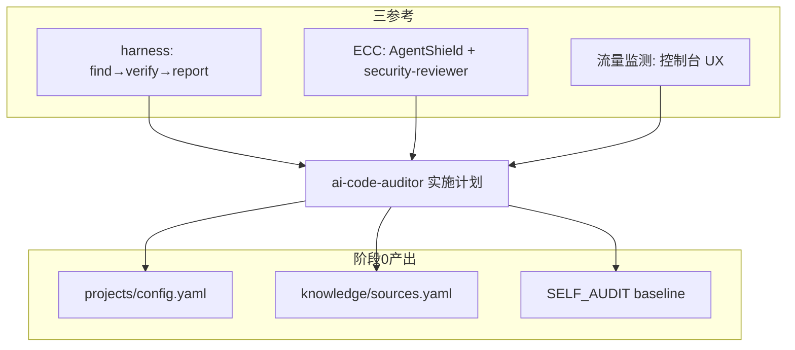

# 阶段 0：环境与认知准备

> **里程碑：** M0 计划就绪  
> **预计工期：** 3–5 天  
> **上一阶段：** —  
> **下一阶段：** [phase-1.md](phase-1.md)

---

## 1. 阶段目标与边界

### 做什么

- 理解三参考项目（harness、ECC-2.0.0、流量监测控制台）的定位与分工
- 开发环境就绪：Python 3.11+、Semgrep、Bandit、gitleaks；可选 `ecc-agentshield`
- 选定金丝雀 AI 应用 repo，起草 `projects/<name>/config.yaml`
- 起草 `knowledge/sources.yaml`（技术雷达白名单源）
- 建立 [SELF_AUDIT.md](../SELF_AUDIT.md) 与 AgentShield baseline 评分
- 输出三参考对照认知笔记（见本文附录 A）

### 不做什么

- **不写** `backend/` 业务代码
- **不搭建** Web 控制台或 LLM 流水线
- **不把** 金丝雀 repo 提交进 `ai-code-auditor` 仓库

---

## 2. 任务拆解与交付清单

### 阅读任务

- [ ] harness：`README.md`、`docs/pipeline.md`、`docs/best-practices.md`、`docs/customizing.md`、`docs/security.md`
- [ ] ECC：`skills/security-scan/SKILL.md`、`agents/security-reviewer.md`（理解 AgentShield 与 harness 分工）
- [ ] 流量监测：`流量监测与安全插件实施计划.md`、`nginx-waf-ai/control-panel.html`（控制台布局参考）
- [ ] 主计划：[实施计划.md](../实施计划.md) 第 5 节威胁模型

### 环境安装

- [ ] Python 3.11+
- [ ] Semgrep、Bandit、gitleaks（验证 `--version`）
- [ ] Docker Desktop（阶段 6 再用，可先装）
- [ ] 可选：`npm install -g ecc-agentshield` 或 `npx ecc-agentshield --version`

### 交付物

- [ ] `projects/<canary-name>/config.yaml` 草稿
- [ ] `knowledge/sources.yaml` 草稿（5–10 个 RSS/GitHub 源）
- [ ] [SELF_AUDIT.md](../SELF_AUDIT.md) 填写 AgentShield baseline 行
- [ ] 金丝雀 repo 手动 Semgrep/Bandit baseline 发现数（记入 SELF_AUDIT）

---

## 3. 架构与数据流

本阶段无运行时代码，重点是认知地图：



---

## 4. 难点与应对

| 难点 | 应对 |
|------|------|
| harness 面向 C/C++ + ASAN，与 Python/JS 静态审计差异大 | 只借鉴流水线形态与 verify 分离思想，检测器换 Semgrep/Bandit |
| ECC 与 harness 职责易混淆 | 牢记：ECC 审 agent 配置，harness 审源码，你的产品两者都要但分轨道 |
| 金丝雀 repo 体量大 | 提前规划 `exclude` 与 `focus_areas` |
| Windows vs Linux 沙箱 | 阶段 0 仅认知，动态验证放 WSL2/CI（阶段 6） |

---

## 5. 安全审计工具的自审要点

| 攻击面 | 缓解 | 本阶段动作 |
|--------|------|-----------|
| 金丝雀含生产密钥 | 扫描前人工清点；`.env` 列入 exclude | 清点清单签字 |
| 误把 ECC 全量复制进项目 | 只借鉴文档与命令，不复制 node_modules | 阅读 ECC-INTEGRATION.md |
| 计划文档泄露内部路径 | `projects/config.yaml` 用本地路径，不进 Git 若含敏感信息 | config 草稿可 gitignore 路径字段说明 |

**SELF_AUDIT 记录项：**

```bash
# 轨2 baseline
npx ecc-agentshield scan --format text

# 轨1 对 ai-code-auditor 自身（阶段1前仅 docs 也可先跑）
semgrep --config auto .
bandit -r . 2>/dev/null || true
```

---

## 6. 测试策略

本阶段**无自动化测试代码**。

| 类型 | 内容 | 通过标准 |
|------|------|----------|
| 工具链冒烟 | `semgrep --version`、`bandit --version`、`gitleaks version` | 均可执行 |
| 金丝雀 baseline | 对金丝雀 repo 手动跑 Semgrep + Bandit | 记录发现数到 SELF_AUDIT |
| AgentShield baseline | `npx ecc-agentshield scan` | 评分记入 SELF_AUDIT |
| 认知验收 | 向他人口述 harness 流程 + ECC/harness 分工 | 无重大误解 |

---

## 7. 验收标准与出口条件

- [ ] 能解释 find → verify → report 流程
- [ ] 能解释「用 AI 写审计工具」与「本地部署」的风险（实施计划第 5 节）
- [ ] 金丝雀 `config.yaml` 草稿就绪
- [ ] `sources.yaml` 草稿就绪
- [ ] SELF_AUDIT 含 AgentShield 与金丝雀 baseline 行
- [ ] 三参考对照表已理解（附录 A）

**出口：** → [phase-1.md](phase-1.md)

---

## 附录 A：三参考项目对照表

| 维度 | harness | ECC-2.0.0 | ai-code-auditor |
|------|---------|-----------|-----------------|
| 定位 | 代码漏洞流水线 | AI 环境运营系统 | 独立审计平台 |
| 扫描对象 | 源码 | `.cursor/`、hooks、MCP | AI 应用 repo |
| 核心借鉴 | pipeline、verify、沙箱、untrusted | AgentShield、RulePack、Prompt Defense | 产品化整合 |
| 关键路径 | `harness/cli.py`、`prompts/` | `skills/security-scan/`、`agents/security-reviewer.md` | `backend/core/` |

详见 [ECC-INTEGRATION.md](../reference/ECC-INTEGRATION.md)。
