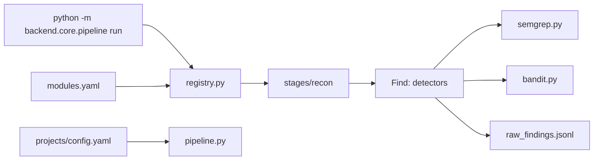

# 阶段 1：最小可运行原型

> **里程碑：** M1 命令行可用  
> **预计工期：** 1–2 周  
> **上一阶段：** [phase-0.md](phase-0.md)  
> **下一阶段：** [phase-2.md](phase-2.md)

---

## 1. 阶段目标与边界

### 做什么

- 创建项目骨架（见实施计划第 3 节目录结构）
- 实现 `backend/core/`：`registry.py`、`pipeline.py`、`context.py`、`events.py`
- `Detector` 协议 + Semgrep、Bandit 插件
- Recon + Find 两阶段流水线
- 产物 `results/<project>/<ts>/raw_findings.jsonl`
- `modules.yaml` 配置启用机制
- 技术雷达 v0：RSS → SQLite（CLI 可查看）
- 初始化 `pyproject.toml`、pytest、`results/` `.gitignore`
- **双轨自审**：Semgrep/Bandit + AgentShield 记入 [SELF_AUDIT.md](../SELF_AUDIT.md)

### 不做什么

- **不集成** AgentShield 为 Detector（阶段 4 的 `config-audit`）
- **不实现** LLM 阶段（verify、triage、report）
- **不搭建** FastAPI / Web 控制台

---

## 2. 任务拆解与交付清单

### 核心代码

- [ ] `backend/core/registry.py` — 扫描 `detectors/`，按 `modules.yaml` 加载
- [ ] `backend/core/context.py` — `ScanContext`、`Finding` Pydantic 模型
- [ ] `backend/core/pipeline.py` — Recon + Find 编排
- [ ] `backend/core/events.py` — 进度事件（为阶段 3 WebSocket 预留）
- [ ] `backend/detectors/semgrep.py`
- [ ] `backend/detectors/bandit.py`
- [ ] `backend/stages/recon.py`
- [ ] `modules.yaml`
- [ ] `projects/<name>/config.yaml` — 含路径白名单校验

### 安全基线（实施计划 5.6 阶段 1）

- [ ] subprocess 参数数组，`shell=False`
- [ ] 路径 canonicalize，拒绝 `..`
- [ ] 仅允许已注册项目路径
- [ ] `results/` 加入 `.gitignore`

### 技术雷达 v0

- [ ] `backend/knowledge/sources.yaml`
- [ ] `backend/knowledge/fetchers/rss.py`
- [ ] `backend/knowledge/cache/feed.db`
- [ ] CLI：`python -m backend.knowledge.cli list`

### 工程化

- [ ] `pyproject.toml` + pytest
- [ ] `tests/conftest.py` — `CANARY_PROJECT_PATH` fixture
- [ ] [SELF_AUDIT.md](../SELF_AUDIT.md) 双轨首次完整记录

---

## 3. 架构与数据流



**关键文件：**

| 文件 | 职责 |
|------|------|
| `backend/core/registry.py` | 插件注册表，禁止 if/else 堆砌 |
| `backend/core/pipeline.py` | 只负责调度，不含检测逻辑 |
| `modules.yaml` | 启用哪些 detector / stage |

---

## 4. 难点与应对

| 难点 | 应对 |
|------|------|
| 注册表设计膨胀 | 新 Detector = 新文件 + yaml 一行；`core/` 尽量不改 |
| subprocess 解析容错 | 超时、非零退出码、JSON 解析失败均转为结构化错误 |
| 多工具 Finding 字段不一 | 统一 `Finding` 模型映射 severity、rule_id、evidence |
| 路径穿越 | `pathlib.Path.resolve()` + 白名单根目录校验 |

**ECC 融入：** 借鉴 hooks 思路，在 **pipeline 代码层** enforce 路径与子进程安全，不靠 prompt。

---

## 5. 安全审计工具的自审要点

| 风险 | 缓解 | 测试 |
|------|------|------|
| 路径遍历 | 白名单 + realpath | `test_path_validation.py` |
| 命令注入 | `subprocess.run([...], shell=False)` | `test_subprocess_wrapper.py` |
| 产物泄露 | `results/` gitignore | 检查 `.gitignore` |
| 扫系统目录 | 仅已注册项目 | 集成测试拒绝未注册 path |
| Agent 配置风险 | AgentShield 扫 `.cursor/` | score ≥ B |

**每批合并前双轨自扫：**

```bash
semgrep --config auto backend/
bandit -r backend/
npx ecc-agentshield scan --format json --min-severity medium
```

结果记入 [SELF_AUDIT.md](../SELF_AUDIT.md)。

---

## 6. 测试策略

### 目录结构

```
tests/
├── conftest.py                 # CANARY_PROJECT_PATH
├── unit/
│   ├── test_path_validation.py
│   ├── test_finding_model.py
│   ├── test_registry.py
│   └── test_subprocess_wrapper.py
├── integration/
│   ├── test_semgrep_detector.py
│   ├── test_bandit_detector.py
│   └── test_pipeline_find_stage.py
└── e2e/
    └── test_canary_scan.py     # @pytest.mark.slow
```

### 各层要求

| 层级 | 工具 | 目标 |
|------|------|------|
| 单元 | pytest | 路径、Finding、registry、subprocess |
| 集成 | pytest + tmp_path | mock CLI 输出、pipeline Find 阶段 |
| E2E | CLI + 金丝雀 | 产出 JSONL，≥1 条与 baseline 一致类发现 |
| 自扫轨1 | semgrep + bandit | `backend/` |
| 自扫轨2 | ecc-agentshield | `.cursor/` |

**覆盖率：** `backend/core/` ≥ 80%

### 金丝雀 E2E 示例

```bash
export CANARY_PROJECT_PATH=/path/to/your-ai-app
pytest tests/e2e/test_canary_scan.py -m slow -v
```

---

## 7. 验收标准与出口条件

- [ ] `python -m backend.core.pipeline run <canary>` 产出 `raw_findings.jsonl`
- [ ] 至少检出：硬编码密钥、SQL 拼接、`subprocess` 类问题（以 baseline 为准）
- [ ] 新增 Detector 仅加文件 + `modules.yaml` 一行
- [ ] 双轨自扫无 Critical
- [ ] 雷达 v0 CLI 可列出 RSS 条目

**出口：** → [phase-2.md](phase-2.md)
