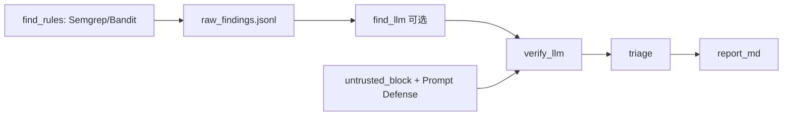

# 阶段 2：AI 深审与验证层

> **里程碑：** M2 AI 报告  
> **预计工期：** 2–3 周  
> **上一阶段：** [phase-1.md](phase-1.md)  
> **下一阶段：** [phase-3.md](phase-3.md)

---

## 1. 阶段目标与边界

### 做什么

- 流水线补全：`verify_llm` → `triage` → `report_md`
- Prompt 模板（借鉴 harness `prompts/find_prompt.py`、`grade_prompt.py`）
- `rules/ai-app/` 规则集（AI 应用特有：Prompt 注入、工具越权等）
- 技术雷达：`keywords.yaml` 打分 + 去重
- `scan_meta.json` 记录 token 用量
- **ECC 融入：** Prompt Defense Baseline + harness untrusted 包裹
- 产出完整 `AUDIT_REPORT.md`

### 不做什么

- **不搭建** Web UI（阶段 3）
- **不实现** config-audit Detector（阶段 4）
- **不默认** 全量文件走 LLM（遵守成本控制策略）

---

## 2. 任务拆解与交付清单

### Pipeline 阶段

- [ ] `backend/stages/find_llm.py`（可选，deep 模式）
- [ ] `backend/stages/verify_llm.py`
- [ ] `backend/stages/triage.py` — 去重、严重度归一化
- [ ] `backend/reporters/markdown.py`
- [ ] `backend/prompts/` — find、verify、report 模板
- [ ] `backend/prompts/untrusted.py` — nonce 包裹（借鉴 harness）
- [ ] `rules/ai-app/` — Semgrep 规则 + prompt 附录

### ECC / harness 整合

- [ ] 移植 ECC Prompt Defense Baseline 至 verify system prompt
- [ ] ECC 危险模式表 → verify prompt 附录
- [ ] 可选：`verify_opus` 三 Agent 变体（attacker / defender / judge）

### 技术雷达

- [ ] `backend/knowledge/keywords.yaml`
- [ ] 打分 + 去重逻辑
- [ ] CLI：`python -m backend.knowledge.cli top --limit 20`

### 成本控制

- [ ] 仅 `confidence < threshold` 或 `severity >= high` 走 LLM
- [ ] Haiku 初筛 → Sonnet 深审
- [ ] `scan_meta.json`：`tokens_in`、`tokens_out`、`model`

### 产物目录（完整）

```
results/<project>/<ts>/
├── recon.json
├── raw_findings.jsonl
├── verified_findings.jsonl
├── TRIAGE.json
├── AUDIT_REPORT.md
└── scan_meta.json
```

---

## 3. 架构与数据流



**设计原则（harness best-practices）：**

- 发现允许噪声；验证对抗式降误报
- verify 环境与 find 隔离：不共享 mutable 状态
- `verified: true` 仅 verify 阶段可置位

---

## 4. 难点与应对

| 难点 | 应对 |
|------|------|
| Prompt 注入（被扫代码含 `</untrusted_data>`） | harness `sanitize_untrusted` + nonce 双标签 |
| API 成本失控 | 规则门控 + 分层模型 + scan_meta 监控 |
| LLM 输出当真理 | 结构化 JSON 输出 + schema 校验 |
| 误报度量 | 记录 verify 前后 finding 数；人工抽检 10 条算 FP 率 |
| 商业机密外传 | 上传前 denylist：`.env`、`*secret*`、密钥文件 |

**可选进阶：** 参考 AgentShield `--opus` 实现简化三 Agent verify。

---

## 5. 安全审计工具的自审要点

| 风险 | 缓解 | 测试 |
|------|------|------|
| API Key 泄露 | env only；日志脱敏 | 断言日志无 `sk-` |
| 恶意代码 prompt 注入 | sanitize + BREAKOUT 测试 | `test_untrusted_sanitize.py` |
| 商业机密外传 | 文件 filter + 可配置 denylist | 集成：`.env` 不上传 |
| LLM 响应注入报告 | 报告生成时转义用户/代码内容 | golden 报告结构 |

**ECC 参考：** [`ECC-2.0.0/agents/security-reviewer.md`](g:\ai安全审计\ECC-2.0.0\agents\security-reviewer.md) 开头 Prompt Defense Baseline。

**harness 参考：** [`tests/test_untrusted.py`](g:\ai安全审计\defending-code-reference-harness\tests\test_untrusted.py)

---

## 6. 测试策略

| 测试文件 | 覆盖 |
|----------|------|
| `test_untrusted_sanitize.py` | BREAKOUT 字符串、裸闭合标签 |
| `test_prompt_defense_baseline.py` | system prompt 含防御基线 |
| `test_triage_dedup.py` | 去重、severity 归一化 |
| `test_verify_llm.py` | mock LLM：升级/降级/拒绝 |
| `test_report_markdown.py` | golden `AUDIT_REPORT.md` 章节结构 |

### 金丝雀回归

```bash
python -m backend.core.pipeline run <canary> --mode deep
```

- 产出完整产物目录
- 人工抽检 10 条 LLM 发现，FP 率记入 SELF_AUDIT
- `scan_meta.json` token 字段合理

### 成本控制测试

- quick 模式跳过 `find_llm`
- deep 模式仅 high/critical 进入 verify

---

## 7. 验收标准与出口条件

- [ ] 金丝雀跑通：recon → find → verify → triage → report
- [ ] verify 后误报率明显下降（与阶段 1 对比）
- [ ] prompt 注入 breakout 单元测试通过
- [ ] 雷达 CLI 输出 Top 20 按分数排序
- [ ] 双轨自扫无 Critical

**出口：** → [phase-3.md](phase-3.md)
