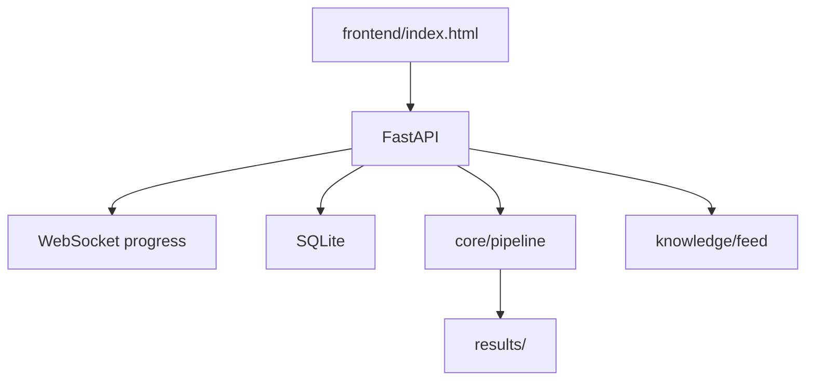

# 阶段 3：Web 控制台

> **里程碑：** M3 可视化  
> **预计工期：** 2–3 周  
> **上一阶段：** [phase-2.md](phase-2.md)  
> **下一阶段：** [phase-4.md](phase-4.md)

---

## 1. 阶段目标与边界

### 做什么

- FastAPI 后端 + SQLite 持久化
- 单页 `frontend/index.html`：Dashboard、扫描、发现、规则、项目、设置
- **Dashboard 首屏：技术雷达**（`/api/knowledge/feed`）
- WebSocket 扫描进度
- Findings Modal + triage（确认/误报/抑制）
- Chart.js 严重度分布
- Knowledge API：refresh、mark-seen、ignore-source
- **安全：** 绑定 `127.0.0.1`；API Key 不进前端；HTML 转义

### 不做什么

- **不开放** `0.0.0.0` 监听（企业版阶段 7）
- **不实现** config-audit、多语言 Detector（阶段 4）
- **不实现** CI/SARIF（阶段 5）

---

## 2. 任务拆解与交付清单

### 后端 API

- [ ] `backend/main.py` — FastAPI 入口，`host=127.0.0.1`
- [ ] `backend/api/` — health、stats、projects、scans、findings、rules、knowledge
- [ ] SQLite 模型：projects、scans、findings、triage 状态
- [ ] WebSocket：`GET /api/scans/{id}/stream`
- [ ] 后台任务：异步执行 pipeline

### 前端

- [ ] 侧边栏导航（对齐流量监测控制台风格）
- [ ] Dashboard：雷达首屏 + KPI 卡片 + 最近发现表
- [ ] 扫描页：选项目、模式、进度条、日志流
- [ ] 发现页：筛选、严重度徽章、Modal 详情
- [ ] 设置页：模型选择、ReportOnly/Block；API Key 仅显示「已配置/未配置」

### ECC 融入

- [ ] 发现详情借鉴 AgentShield html/markdown 报告布局
- [ ] ECC security-review XSS/CSP 清单 → 自测用例
- [ ] Settings 不打印 secret 值（对齐 workspace-surface-audit）

### 安全清单

- [ ] 代码片段 `textContent` 或 HTML 转义，禁止 `innerHTML` 直插
- [ ] 外链 `target="_blank"` + `rel="noopener noreferrer"`
- [ ] POST 接口 origin 检查或 CSRF token
- [ ] 仅返回 `results/` 下已注册项目的产物

---

## 3. 架构与数据流



**API 契约：** 见 [实施计划.md](../实施计划.md) 第 2.3 节。

---

## 4. 难点与应对

| 难点 | 应对 |
|------|------|
| XSS（发现详情渲染代码） | 统一 `escapeHtml()`；禁止 innerHTML 插不可信数据 |
| 本地 API 暴露 | 仅 `127.0.0.1`；文档明确勿改 `0.0.0.0` |
| 扫描与 UI 状态 | WebSocket 断线重连；scan_id 幂等 |
| SQLite 并发 | WAL 模式；写扫描、读列表分离 |
| API Key 进前端 | Settings 只显示布尔状态 |

---

## 5. 安全审计工具的自审要点

| 风险 | 缓解 | 测试 |
|------|------|------|
| XSS | 转义 + 可选 CSP | finding 含 `<script>alert(1)</script>` |
| 未鉴权管理接口 | localhost only | 端口绑定断言 |
| 任意文件读 | 仅 results/ 白名单 | API path traversal 测试 |
| WS 劫持 | 仅本地 | 手动/集成 |
| 密钥进前端存储 | 不存 localStorage | 检查 Settings 实现 |

**ECC 参考：** AgentShield `--format html` 报告结构；security-review 第 5 节 XSS。

---

## 6. 测试策略

| 层级 | 内容 |
|------|------|
| 单元 | `test_escape_html.py` |
| 集成 | FastAPI TestClient：CRUD、scan 发起、findings 列表 |
| 集成 | WebSocket 收到 progress 事件 |
| 安全 E2E | XSS payload finding → DOM 无 script 执行 |
| E2E | 注册项目 → 扫描 → triage 误报 |
| 金丝雀 | 浏览器全流程扫真实 repo |
| 自扫 | 双轨 + 控制台手工 XSS 检查清单 |

```bash
pytest tests/integration/test_api.py -v
pytest tests/security/test_xss_findings.py -v
```

---

## 7. 验收标准与出口条件

- [ ] 打开浏览器首屏见技术雷达，无需手动维护 feed
- [ ] 注册 → 扫描 → 报告 → 标记误报全流程可用
- [ ] XSS 基础防护测试通过
- [ ] API Key 不在前端明文出现
- [ ] 服务仅监听 127.0.0.1

**出口：** → [phase-4.md](phase-4.md)
