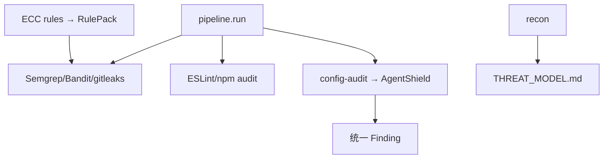

# 阶段 4：多语言与项目配置完善

> **里程碑：** M4 多语言  
> **预计工期：** 1–2 周  
> **上一阶段：** [phase-3.md](phase-3.md)  
> **下一阶段：** [phase-5.md](phase-5.md)

---

## 1. 阶段目标与边界

### 做什么

- 新 Detector：gitleaks、ESLint security、npm audit
- **`config-audit` Detector** — 包装 `ecc-agentshield`，扫描 `.cursor/`、`.claude/`、hooks、MCP
- `config.yaml` 多语言、`focus_areas`
- `THREAT_MODEL.md` 自动生成（recon 扩展）
- 规则热重载 API
- 从 ECC `rules/*/security.md` 提炼 RulePack
- 技术雷达：GitHub Release 监视 + `auto_backlog.json`
- 可选：`AUTO_LLM_CURATE` LLM 摘要

### 不做什么

- **不实现** CI/SARIF/Block 模式（阶段 5）
- **不实现** 动态沙箱（阶段 6）

---

## 2. 任务拆解与交付清单

### Detector 插件

- [ ] `backend/detectors/gitleaks.py`
- [ ] `backend/detectors/eslint_security.py`
- [ ] `backend/detectors/npm_audit.py`
- [ ] `backend/detectors/config_audit.py` — **本阶段 ECC 重点**
- [ ] 各 Detector `plugin.yaml`

### config-audit 设计

```yaml
# backend/plugins/config_audit/plugin.yaml
id: config_audit
name: Agent 配置安全审计
type: detector
requires: []
```

实现要点：

- 调用 `npx ecc-agentshield scan --path <project_root> --format json`
- 解析 JSON → 统一 `Finding`（source: `agentshield`）
- 仅当项目含 `.cursor/` 或 `.claude/` 时启用（或 `modules.yaml` 显式开启）

### RulePack（源自 ECC）

- [ ] `rules/python/` — 从 `ECC-2.0.0/rules/python/security.md` 提炼
- [ ] `rules/javascript/` — 从 `ECC-2.0.0/rules/typescript/security.md` 等
- [ ] `rules/ai-app/` — 扩展 Prompt 注入、工具越权
- [ ] `docs/modules/*.md` — 各规则包说明

### 配置与 recon

- [ ] `config.yaml` 支持 `languages: [python, javascript]`、`focus_areas`
- [ ] `backend/stages/recon.py` 扩展 → 输出 `THREAT_MODEL.md` 草稿
- [ ] `POST /api/rules/reload` — 仅读 `rules/` 固定目录

### 技术雷达

- [ ] `backend/knowledge/fetchers/github.py` — Release 监视
- [ ] `knowledge/auto_backlog.json` 自动生成
- [ ] 可选：`AUTO_LLM_CURATE=true` 批量摘要

---

## 3. 架构与数据流



---

## 4. 难点与应对

| 难点 | 应对 |
|------|------|
| Monorepo 性能 | 排除 `node_modules`、`.venv`；并行 detector |
| severity 归一化 | 映射表：npm audit / Semgrep / AgentShield → 统一等级 |
| Node 工具链依赖 | 文档注明需本机 node/npm；detector 检测缺失时优雅跳过 |
| gitleaks 扫出真密钥 | 报告打码；results gitignore |
| 热重载恶意 yaml | 仅 `rules/` 目录；路径校验 |
| AgentShield 未安装 | 检测 `npx ecc-agentshield`；失败时 warning 非 crash |

---

## 5. 安全审计工具的自审要点

| 风险 | 缓解 |
|------|------|
| config 指定任意路径 | 仍走项目注册白名单 |
| 热重载任意文件 | localhost + 固定 rules 目录 |
| 雷达外链钓鱼 | 摘要 only，不 embed HTML |
| AgentShield 子进程 | 参数数组，超时，JSON schema 校验 |

金丝雀若含 `.cursor/`，本阶段起 E2E 应包含 `config-audit` 发现。

---

## 6. 测试策略

| 测试 | 内容 |
|------|------|
| `test_severity_mapping.py` | 多工具等级映射 |
| `test_config_audit_detector.py` | mock AgentShield JSON 输出 |
| `test_gitleaks_parser.py` | 解析 + 临时 fake secret |
| `test_rules_reload.py` | 热重载 API 路径拒绝 `..` |
| 集成 | 金丝雀 focus_areas Python+JS 子集一次扫完 |
| 雷达 | mock GitHub release → 24h 内 feed 出现 |

```bash
pytest tests/integration/test_config_audit.py -v
python -m backend.core.pipeline run <canary> --mode deep
```

---

## 7. 验收标准与出口条件

- [ ] monorepo（金丝雀）一次扫描完成
- [ ] 配置文件密钥可被 gitleaks 检出
- [ ] 金丝雀 agent 配置面可被 `config-audit` 检出（若有 `.cursor/`）
- [ ] 相关工具发新版时，雷达 24h 内出现在首页
- [ ] RulePack 文档在 `docs/modules/` 可查

**出口：** → [phase-5.md](phase-5.md)
