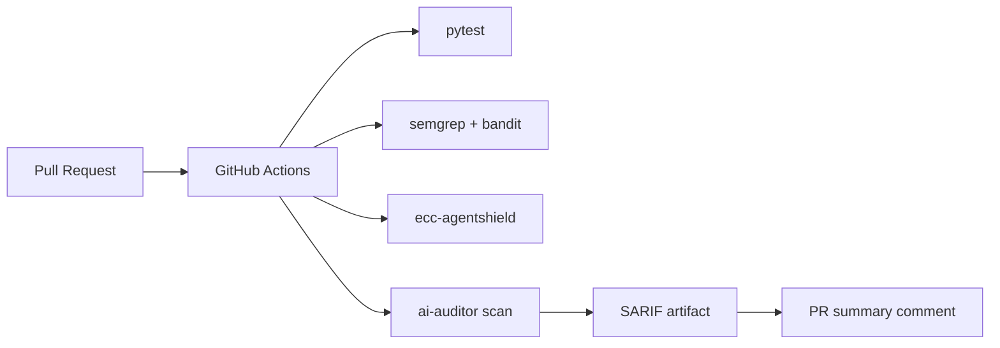

# 阶段 5：CI/CD 接入

> **里程碑：** M5 CI 就绪  
> **预计工期：** 2 周  
> **上一阶段：** [phase-4.md](phase-4.md)  
> **下一阶段：** [phase-6.md](phase-6.md)（可选）/ [phase-7.md](phase-7.md)

---

## 1. 阶段目标与边界

### 做什么

- CLI：`ai-auditor scan --project X --format sarif|json --fail-on critical`
- SARIF Reporter 插件
- GitHub Actions 模板
- 基线对比：仅报告**新增**发现
- ReportOnly / BlockMerge 切换（默认 ReportOnly）
- **CI 双轨自扫：** pytest + semgrep + bandit + **ecc-agentshield** + 主审计

### 不做什么

- **不默认** Block 模式阻断 PR（需显式配置）
- **不实现** 沙箱动态验证（阶段 6）

---

## 2. 任务拆解与交付清单

### CLI

- [ ] `pyproject.toml` entry point：`ai-auditor = backend.cli:main`
- [ ] 子命令：`scan`、`self-audit`、`knowledge refresh`
- [ ] 标志：`--format`、`--fail-on`、`--baseline`、`--mode`

### Reporter

- [ ] `backend/reporters/sarif.py` — schema 合规
- [ ] PR comment 摘要模板（Markdown，非 raw HTML）

### CI 工作流

- [ ] `.github/workflows/self-audit.yml` — 工具自身双轨
- [ ] `.github/workflows/audit.yml` — 金丝雀/目标项目审计（可选）

### ECC verification-loop 合并顺序

```yaml
# .github/workflows/self-audit.yml 示意
jobs:
  self-audit:
    steps:
      - uses: actions/checkout@v4
      - uses: actions/setup-python@v5
        with:
          python-version: "3.11"
      - run: pip install -e ".[dev]"
      - run: pytest
      - run: pip install semgrep bandit && semgrep --config auto backend/
      - run: bandit -r backend/
      - uses: actions/setup-node@v4
      - run: npx ecc-agentshield scan --format json --min-severity medium
      - name: Upload AgentShield report
        uses: actions/upload-artifact@v4
        with:
          name: agentshield-report
          path: agentshield-report.json
```

```yaml
# PR 审计（ReportOnly 默认）
- run: ai-auditor scan --project canary --format sarif --baseline main
- uses: github/codeql-action/upload-sarif@v3  # 或 PR comment action
```

可选并行 job：

```yaml
- uses: affaan-m/agentshield@v1
  with:
    path: "."
    min-severity: "medium"
    fail-on-findings: false  # ReportOnly
```

### 基线对比

- [ ] 存储 branch baseline findings
- [ ] PR diff：仅 `status=new` 的发现
- [ ] Block 模式：`--fail-on critical` → exit code 1

---

## 3. 架构与数据流



---

## 4. 难点与应对

| 难点 | 应对 |
|------|------|
| SARIF 注入 | schema 校验；message 转义；PR comment 用摘要 |
| CI 密钥泄露 | GitHub Secrets；禁止 `echo` env |
| Fork PR 安全 | workflow 权限最小化；不注入 secrets 到 fork |
| 基线漂移 | 存 artifact 或 repo 内 baseline（gitignore 敏感） |
| Block 误阻断 | 默认 ReportOnly；Block 需文档 + 团队共识 |
| AgentShield 在 CI 无 node | setup-node + `npx ecc-agentshield` |

---

## 5. 安全审计工具的自审要点

| 风险 | 缓解 |
|------|------|
| CI 产物含密钥 | 扫描结果脱敏；artifact 不包含 `.env` |
| SARIF 注入 | jsonschema 验证输出 |
| 恶意 PR 触发扫描 | `pull_request` 权限限制；仅 trusted 分支写 comment |
| 日志泄露 | 不打印完整 finding evidence |

实施计划 5.6 阶段 5 检查点全部满足。

---

## 6. 测试策略

| 测试 | 内容 |
|------|------|
| `test_sarif_schema.py` | SARIF 输出符合 schema |
| `test_cli_exit_codes.py` | `--fail-on critical` → 0/1 |
| `test_baseline_diff.py` | 仅 new findings |
| `test_sarif_escape.py` | 恶意 message 不破坏 JSON |
| E2E | `act` 或真实 PR 跑 workflow |
| 金丝雀 | 对 canary 开 PR，验证 comment 摘要 |

```bash
pytest tests/unit/test_sarif_schema.py -v
ai-auditor scan --project canary --format sarif -o /tmp/out.sarif
```

---

## 7. 验收标准与出口条件

- [ ] PR 自动审计并评论摘要
- [ ] CI 产物不含 API Key 或代码密钥
- [ ] 双轨 self-audit workflow 绿
- [ ] ReportOnly 默认；Block 可切换且 exit code 正确
- [ ] SARIF 可被 GitHub Security 或等价工具消费

**出口：** → [phase-6.md](phase-6.md)（可选）或直接进入长期维护
