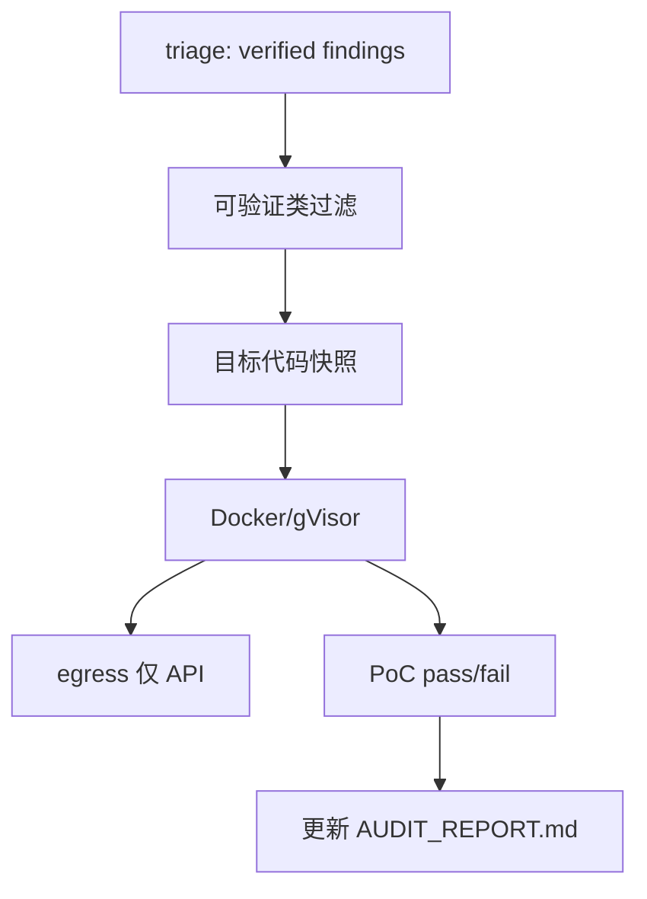

# 阶段 6：动态验证与沙箱（可选）

> **里程碑：** M6 动态验证  
> **预计工期：** 2–4 周  
> **上一阶段：** [phase-5.md](phase-5.md)  
> **下一阶段：** [phase-7.md](phase-7.md)

---

## 1. 阶段目标与边界

### 做什么

- WSL2/Linux + Docker 沙箱环境
- 借鉴 harness `sandbox.py`、`scripts/setup_sandbox.sh`
- egress 白名单；仅对**可验证类**发现启动 PoC
- Windows 开发 → Linux/WSL2 执行分离
- 默认关闭；`--enable-sandbox` 显式开启

### 不做什么

- **不在** Windows 原生运行 gVisor/沙箱 PoC
- **不对** 全量发现跑动态验证（仅 injection 等可验证类）
- **ECC 几乎无直接借鉴** — 本阶段跟 harness，非 ECC

---

## 2. 任务拆解与交付清单

### 环境

- [ ] WSL2 Ubuntu 或 Linux CI 节点
- [ ] Docker Desktop / Docker Engine
- [ ] 可选：gVisor（Linux only，参考 harness `docs/agent-sandbox.md`）

### 代码

- [ ] `backend/stages/verify_sandbox.py` — 可选 pipeline stage
- [ ] `backend/sandbox/runner.py` — 容器生命周期
- [ ] `backend/sandbox/egress.py` — 出站白名单
- [ ] `scripts/setup_sandbox.sh` — 环境初始化
- [ ] `modules.yaml` 默认不启用 sandbox stage

### harness 参考文件

| 源 | 用途 |
|----|------|
| `harness/sandbox.py` | 隔离执行模式 |
| `scripts/setup_sandbox.sh` | 环境搭建 |
| `docs/security.md` | 约束在代码层 enforce |
| `tests/test_sandbox.py` | 隔离测试思路 |

### 验证范围

仅对以下类型发现启用沙箱（可配置）：

- SQL/命令注入
- 路径遍历（若有 PoC 脚本）
- 反序列化（谨慎，高风险）

---

## 3. 架构与数据流



**harness 原则：** 约束在代码层 enforced，不在 prompt。验证环境与 find agent 不共享文件系统。

---

## 4. 难点与应对

| 难点 | 应对 |
|------|------|
| Windows 无 gVisor | 开发在 Win，执行在 WSL2/CI `ubuntu-latest` |
| 恶意 PoC 主机沦陷 | 网络隔离；禁止 privileged、host network |
| Docker 逃逸 | 最小权限；不 mount 敏感路径 |
| Agent 篡改目标 | 快照后只读挂载进沙箱 |
| 成本与耗时 | 仅 high/critical 且 `verified=true` 的少数项 |

---

## 5. 安全审计工具的自审要点

实施计划 5.6 阶段 6 检查点：

| 要求 | 验证 |
|------|------|
| 沙箱网络隔离 | 容器内 curl 外网失败（除 API 白名单） |
| egress 白名单 | 单元测试 allowlist |
| 默认关闭 | 无 flag 不启动容器 |
| 不 mount 密钥路径 | 检查 docker run 参数 |
| 沙箱日志 | 不含主机绝对路径 |

**ECC 融入：** 无。动态验证完全遵循 harness 安全模型。

---

## 6. 测试策略

| 测试 | 环境 | 内容 |
|------|------|------|
| `test_egress_allowlist.py` | 本地 | 规则单元测试 |
| `test_sandbox_runner.py` | Linux/WSL2 | mock docker API |
| 集成 | Linux CI | 无害命令在容器内成功 |
| 负向 | Linux CI | 恶意样本不可读主机文件 |
| E2E | Linux CI | 1 个注入类发现 PoC pass/fail |

```bash
# 仅在 Linux/WSL2 运行
pytest tests/sandbox/ -v -m sandbox
```

**不在 Windows 原生 CI 矩阵中跑沙箱 E2E。**

---

## 7. 验收标准与出口条件

- [ ] 至少 1 个注入类发现经沙箱 PoC 验证（pass 或 fail 均可复现）
- [ ] 沙箱与主机文件系统隔离验证通过
- [ ] egress 白名单测试通过
- [ ] 默认配置下沙箱不启动
- [ ] 文档说明 Windows 用户需 WSL2

**出口：** → [phase-7.md](phase-7.md) 或维持个人本地工具
