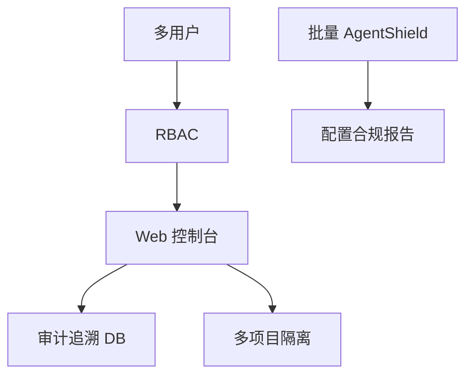

# 阶段 7：企业能力扩展（长期）

> **里程碑：** M7 企业雏形  
> **预计工期：** 持续迭代  
> **上一阶段：** [phase-5.md](phase-5.md) / [phase-6.md](phase-6.md)  
> **性质：** 路线图，非单次交付

---

## 1. 阶段目标与边界

### 做什么（按优先级）

| 能力 | 优先级 | 说明 |
|------|--------|------|
| 审计追溯 | 高 | 谁确认、谁抑制、变更历史 |
| 多项目/多租户 + RBAC | 中 | 团队共享控制台 |
| 合规映射 | 中 | OWASP Top 10、等保、SOC2 |
| 依赖 SBOM | 中 | 物料清单 + 漏洞关联 |
| 通知集成 | 低 | 钉钉/飞书/Slack |
| harness D&R 联动 | 低 | `dnr_harness/` 日志狩猎 |
| 技术雷达外发 | 低 | 摘要同步笔记/邮件 |

### 不做什么

- **不阻塞** M1–M6 个人本地工具交付
- **不在** 未完备鉴权前开放 `0.0.0.0`

---

## 2. 任务拆解与交付清单

### 鉴权与多租户

- [ ] 用户/角色模型（admin、auditor、viewer）
- [ ] triage 操作与角色绑定
- [ ] 项目级数据隔离
- [ ] HTTPS + 会话管理（开放外网前必须）

### 审计追溯

- [ ] `finding_events` 表：confirm / false_positive / suppress
- [ ] 操作者、时间戳、原因
- [ ] 导出审计日志（只读）

### 合规

- [ ] Finding → CWE/OWASP/等保 映射表
- [ ] 报告模板：合规章节
- [ ] ECC RulePack 持续同步（技术雷达驱动）

### ECC 融入（企业场景）

- [ ] 团队成员 `.cursor/` 配置合规扫描（批量 AgentShield）
- [ ] 参考 ECC 多 harness 鉴权思路设计 RBAC
- [ ] 可选：`skills/security-reviewer/` 团队统一交互审计技能

### SBOM

- [ ] CycloneDX/SPDX 生成
- [ ] 与 npm audit / OSV 关联

---

## 3. 架构与数据流

威胁模型从「个人本地」升级为「团队共享」：需防未授权访问、IDOR、越权 triage。

---

## 4. 难点与应对

| 难点 | 应对 |
|------|------|
| 威胁模型升级 | 开放外网前渗透测试清单 |
| 审计日志篡改 | append-only 或签名链 |
| 合规映射维护 | 技术雷达 + auto_backlog 驱动更新 |
| 多租户数据泄露 | 行级隔离 + 集成测试 |
| Agent 配置合规 | 定期 AgentShield 批量扫成员工作区 |

---

## 5. 安全审计工具的自审要点

| 风险 | 缓解 |
|------|------|
| 未授权 API | 全接口鉴权测试矩阵 |
| IDOR | project_id / finding_id 归属校验 |
| 越权 triage | RBAC 集成测试 |
| 审计日志缺失 | 关键操作必须写日志 |
| 团队 `.cursor/` 风险 | AgentShield 合规 job |

开放 `0.0.0.0` 前检查清单：

- [ ] HTTPS
- [ ] 认证 + RBAC
- [ ] 速率限制
- [ ] CSP / XSS 复测
- [ ] 渗透测试或等价审查

---

## 6. 测试策略

| 类型 | 内容 |
|------|------|
| 鉴权矩阵 | 角色 × 接口（admin/auditor/viewer） |
| IDOR | 用户 A 不可访问用户 B 的 finding |
| 审计日志 | triage 后事件可追溯 |
| 多租户 | 数据隔离集成测试 |
| AgentShield 批量 | mock 多路径扫描 job |
| 金丝雀 | 升级为多项目回归集 |

按能力分子里程碑验收，不阻塞 M1–M6。

---

## 7. 验收标准与出口条件

本阶段按**能力项**分别验收，例如：

- **M7a 追溯：** 任意 finding 可查到 triage 历史
- **M7b RBAC：** 三种角色权限测试全通过
- **M7c 合规：** 报告含 OWASP 映射章节
- **M7d 配置合规：** 团队 AgentShield 扫描报告可生成

**贯穿 M8：** [SELF_AUDIT.md](../SELF_AUDIT.md) 持续更新，无 Critical 遗留。

---

## 相关文档

- [实施计划.md](../实施计划.md) 阶段 7 节
- [ECC-INTEGRATION.md](../reference/ECC-INTEGRATION.md)
- [phases/README.md](README.md)
