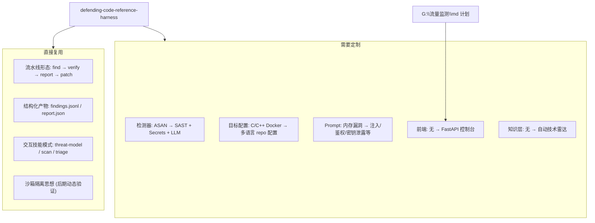

# AI 代码安全审计工具 — 完整实施计划

> 本文档结合前期讨论整理，涵盖：多语言静态审计、AI 深审验证、Web 控制台、CI 接入、模块化扩展、自动技术雷达、工具自身安全、后期沙箱动态验证的完整路线图。  
> 原则：**规则先行、AI 深审、人工确认、先报告后阻断**；本地控制台优先，CI 接入其次；**工具只给自己用，技术动态全自动聚合**。

---

## 目录

1. [项目目标与总体架构](#1-项目目标与总体架构)
2. [前端控制台设计](#2-前端控制台设计)
3. [项目目录规划](#3-项目目录规划)
4. [模块化架构设计](#4-模块化架构设计)
5. [工具自身安全与本地部署威胁模型](#5-工具自身安全与本地部署威胁模型)
6. [自动技术雷达（个人情报系统）](#6-自动技术雷达个人情报系统)
7. [阶段 0：环境与认知准备](#阶段-0环境与认知准备)
8. [阶段 1：最小可运行原型](#阶段-1最小可运行原型)
9. [阶段 2：AI 深审与验证层](#阶段-2ai-深审与验证层)
10. [阶段 3：Web 控制台](#阶段-3web-控制台)
11. [阶段 4：多语言与项目配置完善](#阶段-4多语言与项目配置完善)
12. [阶段 5：CI/CD 接入](#阶段-5cicd-接入)
13. [阶段 6：动态验证与沙箱（可选）](#阶段-6动态验证与沙箱可选)
14. [阶段 7：企业能力扩展（长期）](#阶段-7企业能力扩展长期)
15. [技术选型速查](#技术选型速查)
16. [数据模型（核心契约）](#数据模型核心契约)
17. [参考项目与复用清单](#参考项目与复用清单)
18. [风险与约束](#风险与约束)
19. [验收标准与里程碑](#验收标准与里程碑)

---

## 1. 项目目标与总体架构

### 1.1 最终目标

构建一套**属于自己的代码安全审计平台**，面向个人 AI 应用开发者，逐步积累可带入企业的安全审计能力。包含三层能力：

| 层级 | 能力 | 参考来源 |
|------|------|----------|
| **交互层** | 运维控制台：选项目、发起扫描、查看发现、管理规则、抑制误报；打开即见最新 AI 代码审计动态 | `G:\流量监测\md\流量监测与安全插件实施计划.md` |
| **审计引擎** | AI 驱动的多阶段流水线：侦察 → 发现 → 验证 → 报告 →（可选）修复建议 | `g:\ai安全审计\defending-code-reference-harness` |
| **知识层** | 全自动技术雷达：聚合 RSS/GitHub/arXiv 等源，按相关性打分展示，驱动模块演进 | 本文档第 6 节 |

### 1.2 与参考项目的关系



**不照搬的部分：** 参考项目默认面向 C/C++ + ASAN + Linux gVisor；当前为 Windows 环境，第一版应以**静态分析 + LLM 深审**为主，动态沙箱验证放到后期。

### 1.3 审计范围（多语言）

| 语言/类型 | 典型风险 | 检测手段 |
|-----------|----------|----------|
| Python | 注入、路径遍历、反序列化、硬编码密钥 | Bandit、Semgrep、LLM |
| JS/TS | XSS、原型污染、依赖漏洞 | ESLint security、Semgrep、npm audit |
| 配置文件 | 明文密钥、弱权限、危险默认项 | 正则 + gitleaks/truffleHog + LLM |
| AI 应用特有 | Prompt 注入面、工具调用越权、PII 泄露 | 自定义规则 + LLM 威胁建模 |

### 1.4 分层架构

```
┌─────────────────────────────────────────────────────────────┐
│  前端控制台 (FastAPI 托管的单页 HTML)                         │
│  【技术雷达】打开首页首屏：自动聚合的 AI 代码审计最新动态        │
│  侧边栏: 概览 | 扫描 | 发现 | 规则 | 项目 | 设置              │
│  KPI 卡片 + 发现列表 + 实时扫描进度 + 操作日志                 │
└──────────────────────────┬──────────────────────────────────┘
                           │ REST / WebSocket
┌──────────────────────────▼──────────────────────────────────┐
│  API 层 (FastAPI)                                            │
│  /scans /findings /projects /rules /knowledge/feed          │
└──────────────────────────┬──────────────────────────────────┘
                           │
        ┌──────────────────┼──────────────────┐
        ▼                  ▼                  ▼
┌──────────────┐  ┌──────────────┐  ┌──────────────┐
│ 规则引擎层    │  │ AI 审计层     │  │ 知识层        │
│ Semgrep      │  │ 威胁建模      │  │ RSS 抓取      │
│ Bandit       │  │ 发现 Agent    │  │ GitHub 监视   │
│ gitleaks     │  │ 验证 Agent    │  │ 相关性打分    │
│ 可插拔模块    │  │ 报告 Agent    │  │ 自动 backlog  │
└──────────────┘  └──────────────┘  └──────────────┘
        │                  │                  │
        └──────────────────┼──────────────────┘
                           ▼
                    ┌──────────────┐
                    │ 存储层        │
                    │ SQLite       │
                    │ JSONL 日志   │
                    │ 扫描产物目录  │
                    └──────────────┘
                           │
              （后期）Docker 沙箱动态验证
```

### 1.5 核心设计原则

1. **不是每个文件都跑 AI** — 规则引擎先筛，LLM 只深审可疑点与高价值文件
2. **先 ReportOnly 后 BlockMerge** — 默认只出报告；成熟后再接 CI 阻断
3. **结构化产物落盘** — 每次扫描有独立目录，便于复盘与对比（借鉴 harness 的 `results/<target>/<ts>/`）
4. **人机协作** — 支持 triage（确认/误报/抑制），不追求全自动
5. **可演进** — 个人本地工具 → 团队共享 → CI 门禁，架构不推倒重来
6. **易扩展** — 流水线是骨架，检测器/阶段/规则是插件，用注册表 + 配置启用（见第 4 节）
7. **技术持续更新** — 全自动技术雷达驱动规则与模块演进，无需人工策展（见第 6 节）
8. **审计工具也要被审计** — 用 AI 写代码可以，但不能用 AI 代替安全验证（见第 5 节）

### 1.6 审计流水线（改造自 harness）

| 阶段 | 参考模块 | 你的实现 | 产出 |
|------|----------|----------|------|
| Recon | `harness/recon.py` | 项目结构分析、依赖清单、入口点识别 | `recon.json` |
| Find | `harness/find.py` + skills `/vuln-scan` | 规则扫描 + LLM 逐文件/逐模块审计 | `raw_findings.jsonl` |
| Verify | `harness/grade.py` | 第二路 LLM 或规则交叉验证，降误报 | `verified_findings.jsonl` |
| Triage | skills `/triage` | 去重、分级、FP 过滤 | `TRIAGE.json` |
| Report | `harness/report.py` | 可读报告 + 修复建议 | `AUDIT_REPORT.md` |
| Patch | `harness/patch.py`（可选） | 生成修复 diff，人工审核 | `patches/*.diff` |

**harness 最佳实践摘要（实施时遵循）：**

- **先映射再扫描**：大项目先做威胁建模（`/threat-model`），再按组件分区扫描
- **发现与验证分离**：发现阶段允许噪声；验证阶段用对抗式 grader 降误报
- **验证器是承重件**：廉价规则门控在前，LLM 验证在后；验证环境与发现环境隔离
- **并行需分区**：多 Agent 并行时，每个 Agent 必须有明确的搜索范围（focus area）
- **可以维护多条流水线**：不同模型/不同漏洞类型可用不同 pipeline 变体，结果取并集

---

## 2. 前端控制台设计

对齐 `G:\流量监测\md` 风格：FastAPI 后端 + 轻量单页 HTML 运维控制台（参考 `G:\流量监测\参考项目\nginx-waf-ai\control-panel.html`）。

### 2.1 页面结构

| 导航项 | 内容 |
|--------|------|
| **概览 Dashboard** | **首屏：技术雷达**（自动聚合的 AI 代码审计动态）；KPI：Critical/High/Medium/Low 数量、今日扫描次数；引擎状态卡片；最近发现表格 |
| **扫描 Scans** | 选项目 → 选模式（快速/深度）→ 发起扫描；实时进度条 + 日志流（WebSocket） |
| **发现 Findings** | 可筛选表格：严重度徽章、文件路径、规则 ID、行号、状态（新/已确认/误报） |
| **规则 Rules** | 启用/禁用规则集；自定义 YAML 规则；热重载 |
| **项目 Projects** | 添加本地路径或 Git URL；`config.yaml` 编辑 |
| **设置 Settings** | API Key、模型选择、ReportOnly/Block 模式、技术雷达订阅源、通知 |

### 2.2 发现详情（Modal）

- 代码片段高亮（须转义，防 XSS）
- AI 解释与攻击场景
- CWE/OWASP 映射
- 修复建议
- 操作：确认 / 标记误报 / 抑制路径

### 2.3 API 契约

**审计核心：**

```
GET  /api/health
GET  /api/stats                    # KPI 汇总
GET  /api/projects                 # 项目列表
POST /api/projects                 # 注册项目
POST /api/scans                    # 发起扫描 {project_id, mode}
GET  /api/scans/{id}               # 扫描状态
GET  /api/scans/{id}/stream        # WebSocket 进度
GET  /api/findings?scan_id=&severity=
PATCH /api/findings/{id}           # triage 状态更新
GET  /api/rules
POST /api/rules/reload
GET  /api/modules                  # 已注册模块列表
```

**技术雷达（全自动，无需人工策展）：**

```
GET  /api/knowledge/feed?limit=20&min_score=6
POST /api/knowledge/refresh        # 立即触发抓取
POST /api/knowledge/mark-seen/{id} # 已读后降权（偏好学习，非人工筛选）
POST /api/knowledge/ignore-source/{id}  # 永久忽略某来源
GET  /api/knowledge/backlog        # 自动生成的待跟进模块/规则项
```

### 2.4 与流量监测控制台的对应关系

| 流量监测功能 | 代码审计对应 |
|-------------|-------------|
| 今日拦截数 / Top 攻击 IP | 发现数量 / 严重度分布 / Top 脆弱文件 |
| 最近安全事件表 | 审计发现列表 |
| 实时威胁流 | 扫描进度与新发现流 |
| WAF 规则管理 | 审计规则 / 策略配置 |
| DetectionOnly vs Blocking | ReportOnly vs BlockMerge |
| 引擎状态卡片 | Semgrep / Bandit / LLM 引擎状态 |
| （新增）外部情报 | 技术雷达：AI 代码审计领域自动动态 |

---

## 3. 项目目录规划

项目位于 `g:\ai安全审计\ai-code-auditor\`（与参考 harness 并列）：

```
ai-code-auditor/
├── docs/
│   ├── 实施计划.md              # 本文档
│   ├── SELF_AUDIT.md            # 工具自身安全审计记录（阶段 1 起维护）
│   ├── phases/                  # 各阶段详细实施手册 phase-0.md ~ phase-7.md
│   ├── reference/               # 参考整合文档（如 ECC-INTEGRATION.md）
│   └── modules/                 # 各可插拔模块说明
├── backend/
│   ├── main.py                  # FastAPI 入口
│   ├── api/                     # 路由
│   ├── core/                    # 稳定核心（尽量不改）
│   │   ├── registry.py          # 模块注册表
│   │   ├── pipeline.py          # 流水线编排（只负责调度）
│   │   ├── context.py           # ScanContext、Finding 契约
│   │   └── events.py            # 进度/日志事件
│   ├── detectors/               # Detector 插件
│   │   ├── semgrep.py
│   │   ├── bandit.py
│   │   └── gitleaks.py
│   ├── stages/                  # PipelineStage 插件
│   │   ├── recon.py
│   │   ├── find_llm.py
│   │   └── verify_llm.py
│   ├── reporters/               # Reporter 插件
│   │   ├── markdown.py
│   │   └── sarif.py
│   ├── knowledge/               # 自动技术雷达（独立于审计引擎）
│   │   ├── sources.yaml         # RSS/GitHub 白名单（配置一次）
│   │   ├── keywords.yaml        # 相关性关键词
│   │   ├── auto_actions.yaml    # 关键词 → 建议动作映射
│   │   ├── scheduler.py         # 定时抓取
│   │   ├── fetchers/            # rss.py / github.py / arxiv.py
│   │   └── cache/feed.db        # SQLite 缓存
│   ├── plugins/                 # 实验性/第三方模块
│   │   └── <name>/
│   │       ├── plugin.yaml
│   │       └── detector.py
│   └── models/
├── frontend/
│   └── index.html
├── rules/
│   ├── python/
│   ├── javascript/
│   └── ai-app/
├── projects/
│   └── <project-name>/
│       └── config.yaml
├── results/
├── modules.yaml                 # 全局模块启用配置
├── skills/
└── docker-compose.yml
```

---

## 4. 模块化架构设计

> AI 代码审计技术更新快，项目必须从第一天起支持低成本添加新检测器、新阶段、新规则包。  
> 借鉴 harness 思想：**流水线形态不变，里面的名词可以替换**。

### 4.1 四类可插拔接口

不要按「文件」扩展，按「能力」扩展：

| 模块类型 | 职责 | 示例 |
|----------|------|------|
| **Detector** | 扫描并产出 `Finding` | Semgrep、Bandit、gitleaks、npm audit |
| **PipelineStage** | 流水线某一阶段 | recon、find_rules、find_llm、verify_llm、triage、report |
| **RulePack** | 规则或 Prompt 包 | `rules/ai-app/`、某语言 Semgrep 规则集 |
| **Reporter** | 输出格式 | Markdown、SARIF、JSON |

统一契约示意：

```python
# 概念示意
class Detector(Protocol):
    id: str
    name: str
    supported_languages: list[str]
    def run(self, ctx: ScanContext) -> list[Finding]: ...

class PipelineStage(Protocol):
    id: str
    def run(self, ctx: ScanContext) -> ScanContext: ...
```

### 4.2 注册表 + 配置启用（禁止 if/else 堆砌）

```yaml
# modules.yaml
detectors:
  - semgrep
  - bandit
  - gitleaks
pipeline:
  - recon
  - find_rules
  - find_llm        # 可选，quick 模式可跳过
  - verify_llm
  - triage
  - report_md
reporters:
  - markdown
```

启动流程：扫描 `detectors/`、`stages/` → 按 `modules.yaml` 加载 → `pipeline.run()` 只遍历已启用阶段。  
**加模块 = 新文件 + 配置一行**，不改核心 `core/`。

### 4.3 每个模块附带 `plugin.yaml`

```yaml
id: ai_prompt_injection
name: AI Prompt 注入检测
version: 0.1.0
type: rule_pack          # detector | stage | rule_pack | reporter
languages: [python, javascript]
requires: [semgrep]
config_schema:
  severity_threshold: high
docs: docs/modules/ai_prompt_injection.md
```

控制台可展示「已安装模块」；技术雷达可关联 `suggested_module` 字段，驱动模块演进。

### 4.4 三档扩展难度

| 难度 | 方式 | 频率 | 适合 |
|------|------|------|------|
| **L1 配置级** | 改 `modules.yaml`、开关模块 | 随时 | 日常 |
| **L2 规则级** | 加 Semgrep 规则、Prompt 模板 | 每周 | 技术雷达驱动的大部分更新 |
| **L3 代码级** | 新 Detector / Stage 插件 | 按需 | 新工具、新方法论落地 |

大部分「技术更新」落在 **L2**，不必每次都写 Python。

### 4.5 阶段间数据传递原则

- 阶段之间只通过 `ScanContext` 传数据，不互相直接调用
- 统一 `Finding` 模型（见第 16 节）
- 产物格式统一落盘（`raw_findings.jsonl` 等）
- `core/pipeline.py` 借鉴 `harness/cli.py`：子命令、resume、并行 focus area

### 4.6 与技术雷达的联动

| 雷达检测到的信号 | 自动建议动作 |
|------------------|-------------|
| 新 Semgrep 规则发布 | 检查 `rules/` 是否需同步 |
| harness 文档/代码变更 | 对比参考仓库，提示 prompts 是否更新 |
| OWASP LLM 条目更新 | 提示 `rules/ai-app/` 补规则 |
| 新 SAST 工具发布 | 写入 `knowledge/auto_backlog.json`，建议新建 `plugins/<tool>/` |

第一版：自动 backlog + 控制台展示「待跟进项」；后期再做一键脚手架。

---

## 5. 工具自身安全与本地部署威胁模型

> **核心结论：用 AI 写审计工具，工具本身也会有安全问题；本地运行只能缩小远程攻击面，不能消除风险。**

### 5.1 用 AI 构建工具时的特有风险

| 风险 | 说明 |
|------|------|
| 功能优先、安全后置 | AI 擅长「能跑」，不擅长默认安全边界 |
| 默认信任输入 | 被扫项目、规则文件、LLM 输出被当作可信数据 |
| 危险写法 | `subprocess` 拼 shell、`eval`、路径未校验 |
| 密钥管理随意 | API Key 硬编码、写进日志或前端 Settings |
| 误以为自己会审自己 | 审计逻辑和工具本体是两套代码 |

**原则：用 AI 写代码可以，不能用 AI 代替安全验证。**

### 5.2 本工具的高风险模块

| 模块 | 可能的问题 |
|------|-----------|
| 扫描引擎 | 路径遍历（`../../`）；命令注入（拼接 shell） |
| FastAPI 后端 | 未鉴权管理接口；任意文件读取 |
| Web 控制台 | XSS（发现详情直接渲染代码）；CSRF |
| LLM 调用层 | API Key 泄露；恶意项目代码 Prompt 注入 |
| 项目配置 | `config.yaml` 允许扫任意路径 = 间接读盘 |
| 后期沙箱 | 隔离不彻底，PoC 验证执行恶意代码 |
| 技术雷达 | 自动抓取外部内容，链接钓鱼（个人使用风险较低） |

### 5.3 本地部署的真实威胁模型

本地 ≠ 无风险，而是威胁类型不同：

| 攻击来源 | 本地工具会不会中招 |
|----------|-------------------|
| 外网黑客直接打 API | 低（若只绑定 127.0.0.1） |
| **扫描的恶意/被污染项目** | **会** |
| 本机其他恶意软件 | **会** |
| 误操作（扫了系统敏感目录） | **会** |
| 浏览器 XSS 打本地控制台 | **会** |
| 供应链（依赖包投毒） | **会** |
| LLM 请求上传商业机密 | **会**（数据出本机） |

本地主要防「远程未授权访问」；**防不了「扫的东西有问题」和「工具自己写得不安全」。**

### 5.4 本地版最低安全基线

实施各阶段时须满足：

1. **只绑定 `127.0.0.1`**，不要 `0.0.0.0`
2. **扫描路径白名单**：只允许已注册项目目录
3. **禁止 `..` 路径穿越**
4. **子进程用参数数组**，不拼 shell 字符串
5. **API Key 只放环境变量**，不进前端、不进 Git
6. **`results/` 默认 `.gitignore`**，报告里对密钥打码
7. **LLM 上传前脱敏**（跳过 `.env`、密钥文件，可配置）
8. **控制台输出 HTML 转义**，防 XSS
9. **用当前用户最小权限运行**，不要管理员/root
10. **定期用 Semgrep/Bandit 扫自己工具**，维护 `docs/SELF_AUDIT.md`

### 5.5 发现 / 验证分离同样适用于工具自身

| 阶段 | 对工具自身的应用 |
|------|----------------|
| 发现 | AI 快速生成功能代码 |
| 验证 | Semgrep/Bandit 扫自己 + 人工 review 关键路径 |
| 报告 | `docs/SELF_AUDIT.md` 记录工具自身安全问题 |

### 5.6 各实施阶段的安全检查点

| 阶段 | 须检查 |
|------|--------|
| 阶段 1 | 路径白名单、subprocess 安全、results/ gitignore |
| 阶段 2 | API Key 不进日志；LLM 请求脱敏 |
| 阶段 3 | 绑定 localhost；发现详情 XSS 防护 |
| 阶段 5 | CI 产物不含密钥；SARIF 不注入恶意内容 |
| 阶段 6 | 沙箱网络隔离 + egress 白名单 |

---

## 6. 自动技术雷达（个人情报系统）

> 工具只给自己看，**不需要人工策展**。采用「白名单源 + 自动打分 + 去重 + 本地缓存」，打开首页即可看到 AI 代码审计领域最新动态。

### 6.1 设计目标

- 不是「编辑精选」，而是**个人情报雷达**
- 全自动聚合，按相关性分数排序展示
- 驱动项目演进：新工具/新方法 → 自动 backlog → 模块化落地

### 6.2 自动情报流水线

```mermaid
flowchart LR
    Sources[白名单源] --> Fetcher[定时抓取]
    Fetcher --> Normalize[统一格式]
    Normalize --> Score[相关性打分]
    Score --> Dedup[去重]
    Dedup --> Store[(SQLite feed.db)]
    Store --> API[/api/knowledge/feed]
    API --> Dashboard[首页技术雷达]
```

抓取频率：每 6–24 小时；打开工具时读本地缓存，无需在线等待。

### 6.3 内容来源（白名单，非全网爬虫）

| 类型 | 方式 | 示例源 |
|------|------|--------|
| **RSS/Atom（主力）** | feedparser | Anthropic 博客、GitHub Security Blog、Semgrep Blog、Trail of Bits |
| **GitHub API** | Release/Issue 监视 | defending-code-reference-harness、semgrep、bandit、gitleaks |
| **arXiv（可选）** | API 关键词检索 | LLM vulnerability detection、AI code security |
| **HN/Reddit（可选）** | 关键词过滤 | 噪声大，放最后 |

`knowledge/sources.yaml` 配置一次即可，后续自动运行。

### 6.4 自动过滤：打分排序，非人工审核

```yaml
# knowledge/keywords.yaml 示意
must_match_any:
  - code security
  - vulnerability
  - SAST
  - LLM
  - agent
  - prompt injection
  - Semgrep
  - static analysis
  - AI application
boost:
  - defending code
  - harness
  - verification
  - triage
  - threat model
```

打分逻辑：

```
score = 关键词命中权重 + 来源可信度 + 时效性 - 已读降权 - 重复降权
```

低于阈值（如 6 分）不展示——这是规则过滤，不是人工筛选。

去重：同 URL 只保留一条；标题相似度 > 0.85 合并。

### 6.5 可选：LLM 自动摘要与分类

个人工具推荐开启（`AUTO_LLM_CURATE=true`）：

1. 抓取后批量调用便宜模型（Haiku 级）
2. 输出：`category`、`relevance_1_10`、`one_line_summary`、`suggested_module`
3. 首页只显示 `relevance >= 7`

注意：只送标题 + RSS 摘要 + 链接，不送全文；API Key 走环境变量。

### 6.6 首页展示内容

每条动态显示：

- 标题 + 来源 + 时间
- 一句话摘要（RSS 自带或 LLM 生成）
- 标签：`工具` / `方法论` / `论文` / `规则`
- **建议动作**（规则自动生成，见 `knowledge/auto_actions.yaml`）

```yaml
# knowledge/auto_actions.yaml 示意
rules:
  - match: [semgrep, rule]
    action: check_rules_directory
  - match: [harness, anthropic]
    action: compare_with_reference_harness
  - match: [prompt injection, LLM]
    action: suggest_new_detector:ai_prompt_injection
```

### 6.7 偏好学习（仍非人工策展）

| 操作 | 效果 |
|------|------|
| `mark-seen` | 已读条目降权 |
| `ignore-source` | 某来源永久不看 |

这是个人偏好学习，不是内容审核流程。

### 6.8 实施顺序（融入各阶段）

| 阶段 | 技术雷达任务 |
|------|-------------|
| 阶段 1 | 建 `knowledge/sources.yaml` + RSS 抓取 + 本地 DB |
| 阶段 2 | 加关键词打分 + 去重；harness best-practices 作为首批源 |
| 阶段 3 | Dashboard 首屏展示 feed API；侧边栏「技术雷达」入口 |
| 阶段 4 | 加 GitHub Release 监视；`auto_backlog.json` 自动生成 |
| 阶段 5+ | 可选 LLM 摘要；可选 arXiv/HN |

---

## 阶段 0：环境与认知准备

**预计时间：3–5 天**  
**本阶段做完后：** 理解参考项目架构，开发环境就绪，确定金丝雀测试项目。

### 0.1 任务清单

- [ ] **阅读参考项目文档**
  - `g:\ai安全审计\defending-code-reference-harness\README.md`
  - `g:\ai安全审计\defending-code-reference-harness\docs\pipeline.md`
  - `g:\ai安全审计\defending-code-reference-harness\docs\best-practices.md`
  - `g:\ai安全审计\defending-code-reference-harness\docs\customizing.md`
  - `g:\ai安全审计\defending-code-reference-harness\docs\security.md`

- [ ] **熟悉交互技能流（可选）**
  - 在 Claude Code 中打开 harness 仓库，试跑 `/quickstart`
  - 了解 `/threat-model`、`/vuln-scan`、`/triage` 的输入输出格式

- [ ] **安装开发工具**

  | 工具 | 用途 |
  |------|------|
  | Python 3.11+ | 后端与引擎 |
  | Docker Desktop | 后期沙箱（可先装，阶段 6 再用） |
  | Semgrep | 多语言 SAST |
  | Bandit | Python 安全扫描 |
  | gitleaks | 密钥泄露检测 |

- [ ] **阅读前端参考**
  - `G:\流量监测\md\流量监测与安全插件实施计划.md`（阶段划分写法）
  - `G:\流量监测\参考项目\nginx-waf-ai\control-panel.html`（控制台布局）

- [ ] **选定金丝雀项目**
  - 选一个自己的 AI 应用 repo（含 Python 后端 + 配置文件）
  - 记录路径，作为阶段 1 的测试目标

- [ ] **起草 `knowledge/sources.yaml`**
  - 列出 5–10 个 RSS/GitHub 白名单源（技术雷达用）

### 0.2 本阶段验收标准

- [ ] 能向他人解释 harness 的 find → verify → report 流程
- [ ] 能解释「用 AI 写审计工具」和「本地部署」的安全风险（第 5 节）
- [ ] `semgrep --version`、`bandit --version` 在本地可用
- [ ] 已确定金丝雀项目路径并写入 `projects/<name>/config.yaml` 草稿

### 0.3 下一步

→ 进入 **阶段 1**：实现命令行扫描原型 + 模块注册表骨架。

> **详细实施手册：** [`docs/phases/phase-0.md`](phases/phase-0.md)

---

## 阶段 1：最小可运行原型

**预计时间：1–2 周**  
**本阶段做完后：** 命令行可扫描本地 Python 项目，输出结构化 JSON 发现列表；模块注册表就绪。

### 1.1 任务清单

- [ ] 创建项目骨架（目录结构见第 3 节）
- [ ] 实现 `core/registry.py` + `modules.yaml` 模块启用机制
- [ ] 定义 `Detector` 接口；Semgrep、Bandit 作为前两个插件
- [ ] 实现 `projects/<name>/config.yaml`（含路径白名单校验）
- [ ] 定义统一 `Finding` 数据模型（见第 16 节）
- [ ] 实现 `core/pipeline.py` 的 Recon + Find 两阶段
- [ ] 产物写入 `results/<project>/<ts>/raw_findings.jsonl`
- [ ] **安全**：subprocess 参数数组、路径穿越检查、`results/` 加入 `.gitignore`
- [ ] 创建 `docs/SELF_AUDIT.md` 模板
- [ ] **技术雷达 v0**：RSS 抓取 → `knowledge/cache/feed.db`（命令行可查看）

### 1.2 本阶段验收标准

- [ ] `python -m core.pipeline run my-ai-app` 产出结构化 JSON
- [ ] 至少能检出：硬编码密钥、SQL 拼接、`subprocess` 命令注入
- [ ] 新增 Detector 只需加文件 + `modules.yaml` 一行
- [ ] 对工具自身跑 Semgrep/Bandit，结果记入 `SELF_AUDIT.md`

### 1.3 下一步

→ 进入 **阶段 2**：引入 LLM 验证层与技术雷达打分。

> **详细实施手册：** [`docs/phases/phase-1.md`](phases/phase-1.md)

---

## 阶段 2：AI 深审与验证层

**预计时间：2–3 周**  
**本阶段做完后：** 完整流水线产出 `AUDIT_REPORT.md`；技术雷达支持相关性打分。

### 2.1 任务清单

- [ ] `verify_llm` 作为独立 PipelineStage 插件
- [ ] 借鉴 `harness/prompts/find_prompt.py`、`grade_prompt.py` 编写多语言 prompt
- [ ] 实现 Triage 阶段：去重、严重度归一化
- [ ] 生成 `AUDIT_REPORT.md`（`report_md` Reporter 插件）
- [ ] 增加 `rules/ai-app/` 规则集
- [ ] **技术雷达**：`keywords.yaml` 打分 + 去重；将 harness 相关源加入订阅

### 2.2 成本控制策略

- 规则先过滤，仅对 `confidence < threshold` 或 `severity >= high` 调用 LLM
- 分层模型：Haiku 初筛，Sonnet 深审
- token 用量写入 `scan_meta.json`

### 2.3 本阶段验收标准

- [ ] 金丝雀项目跑通：recon → find → verify → triage → report
- [ ] 误报率经 verify 后明显下降
- [ ] 技术雷达命令行可输出按分数排序的 Top 20 条目

### 2.4 下一步

→ 进入 **阶段 3**：Web 控制台 + 首页技术雷达。

> **详细实施手册：** [`docs/phases/phase-2.md`](phases/phase-2.md)

---

## 阶段 3：Web 控制台

**预计时间：2–3 周**  
**本阶段做完后：** 浏览器完成全流程；打开首页首屏即见技术雷达。

### 3.1 任务清单

- [ ] FastAPI 后端 + SQLite
- [ ] 前端：侧边栏、KPI、发现表格、扫描页
- [ ] **Dashboard 首屏：技术雷达组件**（读 `/api/knowledge/feed`）
- [ ] WebSocket 扫描进度
- [ ] Findings Modal + triage；**代码片段 HTML 转义**
- [ ] Chart.js 严重度分布与趋势图
- [ ] **安全**：只绑定 `127.0.0.1`；API Key 不进前端
- [ ] `POST /api/knowledge/refresh`、`mark-seen`、`ignore-source`

### 3.2 本阶段验收标准

- [ ] 打开浏览器即可看到自动更新的技术动态，无需手动维护 feed
- [ ] 注册项目 → 扫描 → 查看报告 → 标记误报，全流程可用
- [ ] 控制台 XSS 基础防护到位

### 3.3 下一步

→ 进入 **阶段 4**：多语言 + 技术雷达 GitHub 监视。

> **详细实施手册：** [`docs/phases/phase-3.md`](phases/phase-3.md)

---

## 阶段 4：多语言与项目配置完善

**预计时间：1–2 周**  
**本阶段做完后：** Python + JS/TS monorepo 可扫；雷达可监视工具 Release。

### 4.1 任务清单

- [ ] 新 Detector 插件：ESLint security、npm audit
- [ ] `config.yaml` 多语言、focus_areas
- [ ] `THREAT_MODEL.md` 自动生成
- [ ] 规则热重载 API
- [ ] **技术雷达**：GitHub Release 监视；`auto_backlog.json` 自动生成
- [ ] 可选：`AUTO_LLM_CURATE` LLM 自动摘要

### 4.2 本阶段验收标准

- [ ] monorepo 一次扫描完成
- [ ] 配置文件密钥可被 gitleaks 检出
- [ ] 相关工具发新版时，雷达 24h 内出现在首页

### 4.3 下一步

→ 进入 **阶段 5**：CI/CD。

> **详细实施手册：** [`docs/phases/phase-4.md`](phases/phase-4.md)

---

## 阶段 5：CI/CD 接入

**预计时间：2 周**  
**本阶段做完后：** PR 自动审计，ReportOnly / Block 可切换。

### 5.1 任务清单

- [ ] CLI：`ai-auditor scan --project X --format sarif|json --fail-on critical`
- [ ] GitHub Actions 模板
- [ ] SARIF Reporter 插件
- [ ] 基线对比：仅报告新增发现
- [ ] Block 模式：Critical 时 exit code 非 0

### 5.2 本阶段验收标准

- [ ] PR 自动审计并评论摘要
- [ ] CI 产物不含 API Key 或代码密钥

### 5.3 下一步

→ 视需要进入 **阶段 6**。

> **详细实施手册：** [`docs/phases/phase-5.md`](phases/phase-5.md)

---

## 阶段 6：动态验证与沙箱（可选）

**预计时间：2–4 周**  
**本阶段做完后：** 高危发现可 PoC 级动态验证。

### 6.1 任务清单

- [ ] WSL2/Linux VM + Docker +（可选）gVisor
- [ ] 参考 `scripts/setup_sandbox.sh`、`harness/sandbox.py`
- [ ] 沙箱 egress 白名单
- [ ] 仅对可验证类发现启动沙箱

### 6.2 注意事项

- Windows 原生不支持 gVisor，在 WSL2 或 Linux CI 运行
- 沙箱执行恶意代码风险极高，必须网络隔离

### 6.3 本阶段验收标准

- [ ] 至少一个注入类发现经沙箱 PoC 验证
- [ ] 沙箱与主机文件系统隔离

> **详细实施手册：** [`docs/phases/phase-6.md`](phases/phase-6.md)

---

## 阶段 7：企业能力扩展（长期）

| 能力 | 说明 | 优先级 |
|------|------|--------|
| 多项目/多租户 | 团队共享控制台，RBAC | 中 |
| 审计追溯 | 谁确认、谁抑制、变更历史 | 高 |
| 合规映射 | OWASP Top 10、等保、SOC2 | 中 |
| 依赖 SBOM | 软件物料清单 + 漏洞关联 | 中 |
| harness D&R 联动 | `dnr_harness/` 日志狩猎模块 | 低 |
| 通知集成 | 钉钉/飞书/Slack | 低 |
| 技术雷达外发 | 可选：雷达摘要同步到笔记/邮件 | 低 |

> **详细实施手册：** [`docs/phases/phase-7.md`](phases/phase-7.md)

---

## 技术选型速查

| 组件 | 选择 | 理由 |
|------|------|------|
| 后端 | FastAPI + Pydantic | 与流量监测计划一致，异步友好 |
| 前端 | 单页 HTML + CSS + Chart.js | 轻量、无构建链 |
| 模块化 | registry + modules.yaml + plugin.yaml | 低成本扩展 |
| 规则引擎 | Semgrep + Bandit | 开源、可自定义 |
| 密钥扫描 | gitleaks / truffleHog | 配置与代码通扫 |
| AI | Claude API（或兼容网关） | 与 harness 生态一致 |
| 技术雷达 | feedparser + GitHub API + SQLite | 全自动个人情报 |
| 雷达摘要（可选） | Haiku 级模型 | 低成本自动分类 |
| 存储 | SQLite + JSONL + 文件系统 | 个人本地足够 |
| 后期沙箱 | Docker + WSL2/Linux | Windows 开发，Linux 跑沙箱 |
| CI | GitHub Actions | 生态最广 |

---

## 数据模型（核心契约）

### Finding

```yaml
id: "finding-uuid"
scan_id: "scan-uuid"
project: "my-ai-app"
severity: critical | high | medium | low | info
confidence: 0.0-1.0
source: semgrep | bandit | gitleaks | llm_find | llm_verify
rule_id: "python.lang.security.audit.exec-detected"
file: "app/main.py"
line: 42
message: "可能的命令注入"
evidence: "subprocess.call(user_input)"
cwe: "CWE-78"
status: new | confirmed | false_positive | suppressed
verified: true | false
report_section: "..."
remediation: "..."
```

### 扫描产物目录

```
results/my-ai-app/2026-07-28T153000/
├── recon.json
├── raw_findings.jsonl
├── verified_findings.jsonl
├── TRIAGE.json
├── AUDIT_REPORT.md
└── scan_meta.json
```

### 项目配置

```yaml
name: my-ai-app
path: G:/projects/my-ai-app
languages: [python, javascript]
exclude:
  - "**/node_modules/**"
  - "**/.venv/**"
scan_mode: quick | deep
fail_on: critical
focus_areas:
  - path: app/api/
    description: "对外 API 入口"
  - path: app/agents/
    description: "LLM Agent 工具调用"
```

### 技术雷达条目（KnowledgeItem）

```yaml
id: "uuid"
title: "发现与验证分离是承重设计"
url: "https://..."
source: "anthropic-harness-docs"
source_type: rss | github | arxiv
published_at: "2026-07-20T10:00:00Z"
summary: "发现阶段允许噪声，验证阶段对抗式过滤"
category: methodology    # tool | paper | blog | methodology | rule
score: 8.5
tags: [verification, agent]
suggested_module: verify_llm
suggested_action: compare_with_reference_harness
seen: false
```

---

## 参考项目与复用清单

### 本地参考

| 参考 | 路径 | 借鉴内容 |
|------|------|----------|
| 审计引擎 | `g:\ai安全审计\defending-code-reference-harness` | 流水线、沙箱、技能、产物模型、untrusted 测试 |
| Agent 配置审计 | `g:\ai安全审计\ECC-2.0.0` + `ecc-agentshield` | SELF_AUDIT 轨2、config-audit Detector、CI 门禁 |
| 审查清单与规则 | `g:\ai安全审计\ECC-2.0.0\rules\`、`security-review` skill | RulePack、报告章节、verify prompt |
| 开发时审查 | `g:\ai安全审计\ECC-2.0.0\agents\security-reviewer.md` | `skills/` 交互审计、Prompt Defense |
| 控制台风格 | `G:\流量监测\md` + nginx-waf-ai | 运维控制台布局 |
| 安全仪表盘 | `G:\流量监测\参考项目\nginx-defender\web\` | KPI、图表、WebSocket |

> ECC 整合专文：[`docs/reference/ECC-INTEGRATION.md`](reference/ECC-INTEGRATION.md)  
> 各阶段执行手册：[`docs/phases/README.md`](phases/README.md)

### harness 具体复用文件

| 借鉴内容 | 源路径 | 用途 |
|----------|--------|------|
| 流水线编排 | `harness/cli.py` | `core/pipeline.py` |
| Agent 调用 | `harness/agent.py` | LLM 调用、transcript |
| Prompt 结构 | `harness/prompts/*.py` | find/verify/report 模板 |
| 产物模型 | `harness/artifacts.py` | Finding/Report 结构 |
| 去重逻辑 | `harness/dedup.py` | 发现聚类 |
| 交互技能 | `.claude/skills/*` | Cursor 内交互审计 |
| 目标配置 | `targets/README.md` | `projects/` 规范 |
| 安全文档 | `docs/security.md`, `docs/agent-sandbox.md` | 沙箱与工具自身安全 |
| 最佳实践 | `docs/best-practices.md` | 验证分离、分区并行 |
| 定制化指南 | `docs/customizing.md` | 模块化扩展思路 |

---

## 风险与约束

| 风险 | 缓解 |
|------|------|
| LLM 误报/漏报 | 规则 + 双 Agent 验证；人工 triage |
| API 成本 | 分层模型；仅深审高风险项；scan_meta 记录用量 |
| **AI 生成代码不安全** | 工具自身 Semgrep/Bandit；SELF_AUDIT.md；关键路径人工 review |
| **本地部署误觉安全** | 路径白名单；被扫项目视为不可信；localhost 绑定 |
| **敏感数据外传** | LLM 上传脱敏；results/ gitignore；报告打码 |
| Windows 无 gVisor | 前期纯静态；动态验证放 WSL2/Linux CI |
| 技术雷达噪声 | 白名单源 + 关键词打分 + 去重；可选 LLM relevance |
| 技术雷达链接风险 | 只展示摘要不嵌入 HTML；外链新标签打开 |
| 参考项目不维护 | 只借鉴架构；雷达监视 harness 变更并提示同步 |
| 金丝雀项目含密钥 | 扫描前脱敏 |

---

## 验收标准与里程碑

| 里程碑 | 阶段 | 标志 |
|--------|------|------|
| M0 计划就绪 | 0 | 本文档完成，环境工具可用 |
| M1 命令行可用 | 1 | 能扫 Python 项目出 JSON；模块注册表可用 |
| M2 AI 报告 | 2 | 有 Markdown 审计报告；雷达可打分排序 |
| M3 可视化 | 3 | 浏览器全流程；首页技术雷达自动展示 |
| M4 多语言 | 4 | Python + JS 通扫；GitHub Release 监视 |
| M5 CI 就绪 | 5 | PR 自动审计 |
| M6 动态验证 | 6 | 沙箱 PoC 可用 |
| M7 企业雏形 | 7 | 可演示完整方案 |
| **M8 工具自审** | 贯穿 | `SELF_AUDIT.md` 持续更新，无 Critical 遗留 |

---

## 附录：建议执行顺序

1. **现在**：阶段 0 — 阅读文档、安装工具、选金丝雀项目、起草 `sources.yaml`
2. **第 1–2 周**：阶段 1 — 命令行原型 + 模块注册表 + 雷达 RSS v0 + 工具自扫
3. **第 3–5 周**：阶段 2 — LLM 验证 + 雷达打分
4. **第 6–8 周**：阶段 3 — Web 控制台 + 首页技术雷达
5. **第 9–10 周**：阶段 4–5 — 多语言 + CI
6. **后期**：阶段 6–7 — 沙箱 + 企业能力

> **三个贯穿原则：**  
> ① 先让流水线在命令行跑通，再投入 UI  
> ② 先 ReportOnly，成熟后再 Block  
> ③ **做审计工具的人，也要给自己的工具做审计**
